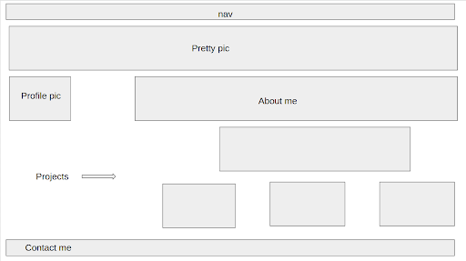

# melissastan-portfolio

The purpose of this challenge is to create a portfolio using pure HTML and CSS. 

## Website Screenshot
This is what the website needs to look like after refactoring the code.

## How to Create a Portolio
* Create HTML, style.css, and reset.css from scratch.
* Embed responsive links to the projects section.
* Fix the footer's color and embed linkedin link.
* Make the page reponsive with different mobiles by adding @media.
* Organize the style.css in cascading format.

## How to deploy the link application
* Click on this link for deployed application
* https://mstan19.github.io/melissastan-portfolio/
